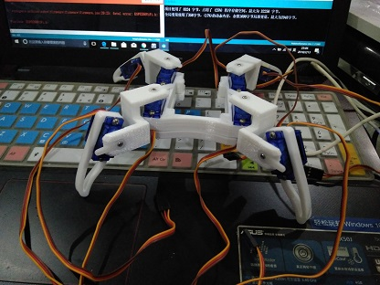

# Q-bot
Quadruped-robot

综合多个四足机器人([Q1 lite](https://www.thingiverse.com/thing:2732957)、[Q1 mini](https://www.thingiverse.com/thing:2311678)、[Spider robot](https://www.thingiverse.com/thing:1009659)等)的优点设计的一款小四足

- 不需要额外的螺丝
- 使用廉价的arduino nano加xd-212扩展板即可控制
- 正在尝试移植到nodemcu平台上

欢迎大家尝试DIY、共同改善这款机器人
